# AIengineering Chatbot 🤖
The Alengineering Chatbot is a Retrieval-Augmented Generation (RAG)bot of my teachers Kokchuns youtube channel. Where the user can chat and retrieve information from his channel. 
The chatbot is streamed as an webbap from Azure using Streamlit. 

## Architecture🧾

The system has three main components:

##### 1. Frontend (Streamlit Web App)
Provides a chat interface.  
Built with Streamlit and containerized using Docker.  

##### 2. API Layer (FastAPI in Azure Function)
Hosts REST API endpoints for chat queries and history.  
Runs FastAPI inside the Azure Function app.
Handles HTTP requests from the frontend and forwards them to backend logic.  

##### 3. Backend (RAG Agent and Data Handling)
This layer ingests data from my teacher’s YouTube channel into a LanceDB vector database, creating embedding representations of the documents with LanceModel.

The stored data is then processed by the RAG Agent, which uses LanceDB to perform similarity searches based on embeddings to find the closest matching documents for a given query.

Data models are structured and validated using Pydantic BaseModel to ensure consistent and reliable data handling throughout the App.

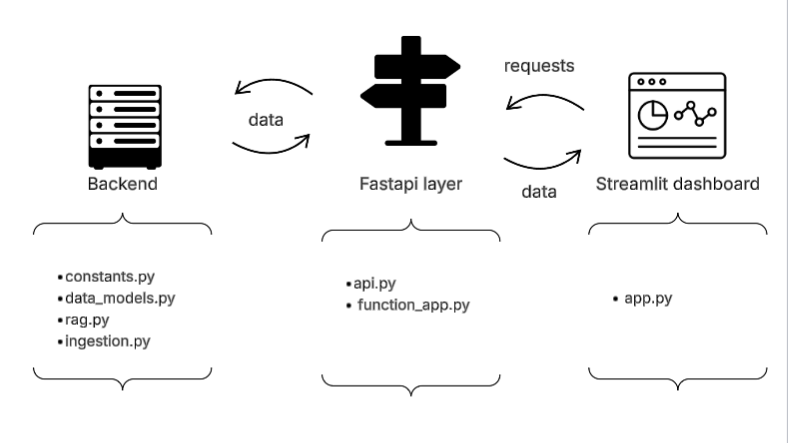

## Key Technologies 🛠️

**Frontend**  
- Streamlit  
- Docker 
- Python

**API Layer**  
- FastAPI
- Azure Functions

**Backend**  
- Pydantic
- LanceDB
- OpenAI
- GPT-4.1
- OpenAI Embeddings 

**Infrastructure**  
Azure Function app

With Terraform: 
- Azure App Service, 
- Azure App service plan 
- Azure Container Registry (ACR)

## Requiered prior programs and installations

* VS Code
* Docker
* Azure account
* Azure Functions i VS Code

## Guide for setup

#### 1) Clone the repository

#### 2) Log into Azure 

az login

az account set --subscription "<SUBSCRIPTION_ID"

#### 3) Create an Azure function of the repo

My Teacher Kochun provides excellent instrutions for that process if you need help:

https://github.com/AIgineerAB/AI_engineering_four_weeks_course/tree/main/11_deploy_rag_serverless

#### 4) Setup for Function App 

After deployment:

1) Create an .env file, where add your own API key for the AI agent (rag_agent) of any model since Pydantic_ai is model agnostic

    Furthermore, add the default key from your created function app to .env, use e.g. naming convention - (FUNCTION_API_KEY)

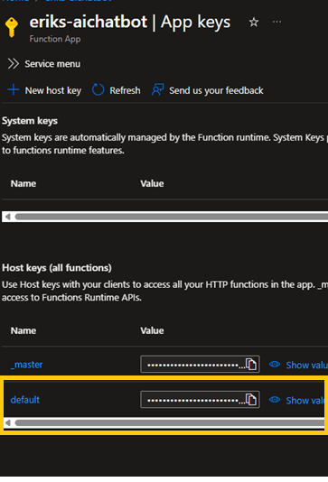

2) Change the given name url name in app.py to the one you used when created the Function App

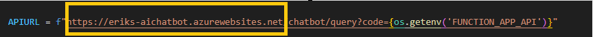

3) If you want to start the application locally:

- In the root folder set upp virtual enviroment: uv init
- Install requirments files: 
uv pip install -r requirements.txt 
- Then from the root folder run: uv run streamlit run frontend/app.py

#### 5) Setting upp resorces for a App Service plan, ACR and Web App Service in Azure 

1) In resources.tf, change the resource name to the same that you used when you created the Function app.

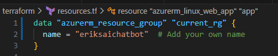

2) In variabels.tf, according to your own choice, change names for: 
- location
- prefix_app_name
- docker_image_name

3) In terraform.tfvars, add:
- your own Azure subscription id
- AI API key, If you change API Key, you will need change AI Agent and embedings model though. 
- The key for function_app_api (see step 4
 above)

 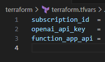

4) Place your self in the Terraform folder

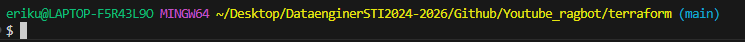

And then run the following commands sequentially:

terraform init

terraform plan

terraform apply

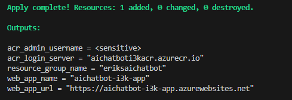

#### 6) Pushing the app to ACR as an app image with docker

Run the follwoing syntax from the root of the repo with prefered name*:

- docker tag eriks-chatbot:latest aichatboti3kacr.azurecr.io/eriks-chatbot:latest

- docker push aichatboti3kacr.azurecr.io/eriks-chatbot:latest

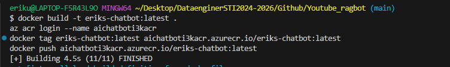

* *If you change name for the image, use the same name that you gave it in variabels.tf:

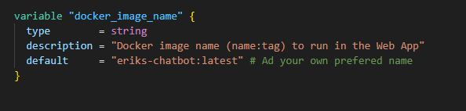

#### 7) Connect the image to the created Azure webbapp

By clicking the defaut choices in the boxes.

After that you can run it as a webapp.

But don´t forget to have the Function App running since the dockerized app uses it´s URL.

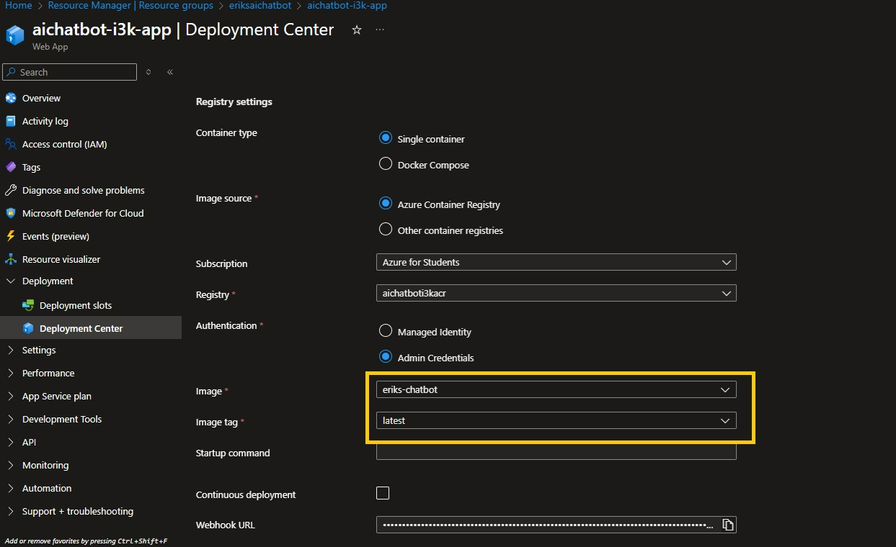

####8 The final result

Here you have the chatbot in action.

- You can ask the chatbot anything related to programming
- In each answer from the chatbot, it provides the actual source used from my teachers Youtube channel. You can find the sources in the data folder in the repo.
- As you can see it has a memory function for retrievning earlier messages

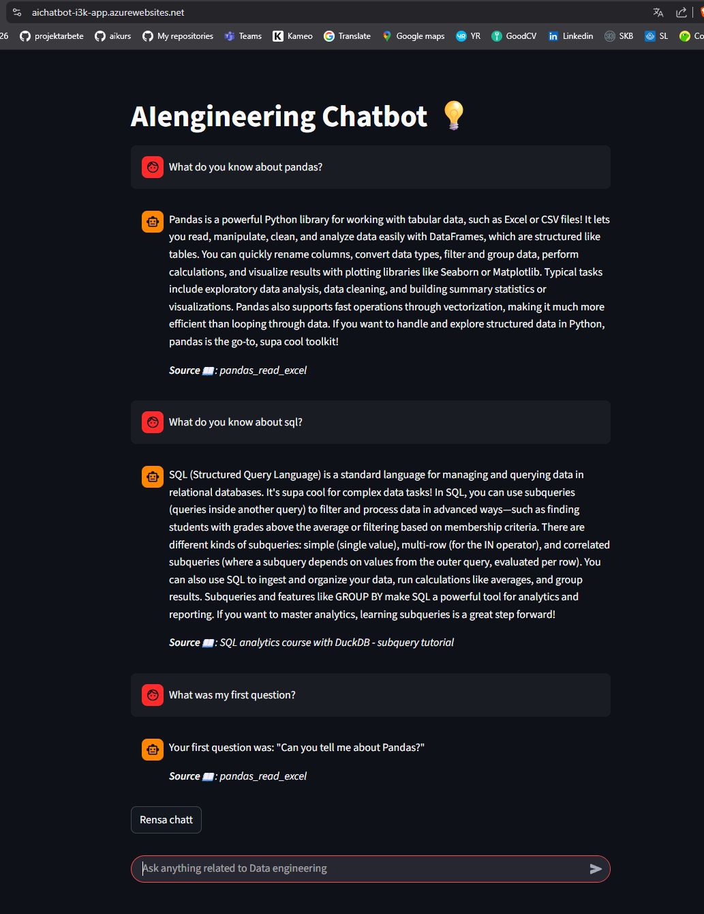

## All the best / Erik🤙 

